Dynamic Programming
================
Yoshinari Namba
2022-08-10

# Introduction

This is a replication of [Adams, et al.(2015)](#reference), mainly based
on Chapter 7.

## Overview

1.  [Replication](#1-replication)
    1.  Value Function Iteration
    2.  Policy Function Iteration
    3.  Finite Stochastic Dynamic Programming
2.  [Exercise](#2-exercise)

# 1. Replication

## Setup

``` r
# initialize
rm(list = ls())

# package
if(!require(pacman)) install.packages("packman")
pacman::p_load(
  tidyverse, 
  tictoc, 
  RColorBrewer
)
```

## 1-1. Value Function Iteration

``` r
# one iteration of the value function
IterateVF <- function(V, maxK){
  # basic parameters
  Alpha <- 0.65
  Beta <- 0.9
  Theta <- 1.2
  
  grid <- length(V)
  K <- seq(from = 1e-6, to = maxK, length.out = grid)
  TV <- rep(0, length(V))
  optK <- rep(0, length(V))
  
  # loop through and create new value function for each possible capital value
  for(k in 1:grid){
    c <- rep(Theta*(K[k]^Alpha), grid) - K
    c[c<=0] <- rep(0, sum(c<=0))
    u <- log(c)
    candid <- u + Beta*V
    TV[k] <- max(candid)
    optK[k] <- which(candid == max(candid))
  }
  
  # time consuming method 
  # candid <- rep(NA, 1000)
  # c <- rep(NA, grid)
  # u <- rep(NA, grid)
  # 
  # for(k in 1:grid){
  #   for(k_tilde in 1:grid){
  #     c[k_tilde] <- Theta*(K[k]^Alpha)-K[k_tilde]
  #     c[k_tilde] <- ifelse(c[k_tilde] > 0, c[k_tilde], 0)
  #     u[k_tilde] <- log(c[k_tilde])
  #     candid[k_tilde] <- u[k_tilde] + Beta*V[k_tilde]
  #   }
  #   TV[k] <- max(candid)
  #   optK[k] <- K[which(candid == max(candid))]
  # }
  
  sol <- matrix(c(TV, optK), nrow = length(V), ncol = 2, byrow = FALSE)
  return(sol)
}
```

Analytical solution

``` r
# set parameters, plot analytical solution
Beta <- 0.9
Alpha <- 0.65
Theta <- 1.2
aB <- Alpha*Beta
K <- seq(from = 1e-6, to = 100, length.out = 1000)

E <- Alpha / (1 - aB)
f <- (1/(1-Beta))*(log(Theta*(1-aB))) + aB*log(aB*Theta)/((1-aB)*(1-Beta))
soln <- E*log(K) + f

ggplot() + 
  geom_line(aes(x = K, y = soln)) + 
  ylim(c(-15, NA)) + 
  xlab("Amount of Capital") + ylab("Value Function") +
  theme_classic() 
```

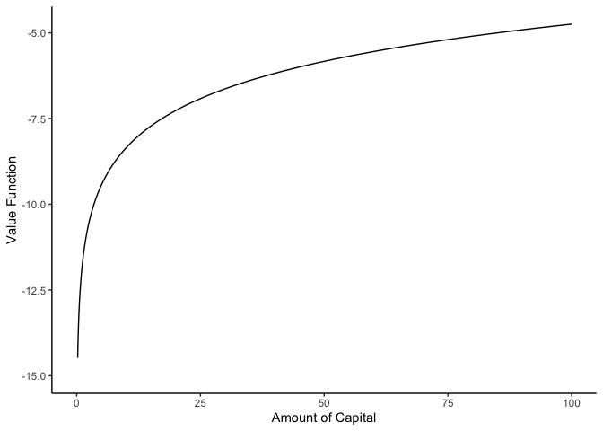<!-- -->

Iterated graph

``` r
tic()
n <- 15
# 10 iterations 
TV <- matrix(rep(NA, 1000*n), ncol = n)
TV[, 1] <- rep(0, 1000) 

for(iter in 1:n){
  cat("Iteration number:", iter, "\n")
  if(iter < n) TV[, iter+1] <- IterateVF(TV[, iter], 100)[, 1]
}
```

    ## Iteration number: 1 
    ## Iteration number: 2 
    ## Iteration number: 3 
    ## Iteration number: 4 
    ## Iteration number: 5 
    ## Iteration number: 6 
    ## Iteration number: 7 
    ## Iteration number: 8 
    ## Iteration number: 9 
    ## Iteration number: 10 
    ## Iteration number: 11 
    ## Iteration number: 12 
    ## Iteration number: 13 
    ## Iteration number: 14 
    ## Iteration number: 15

``` r
toc()
```

    ## 0.417 sec elapsed

``` r
# plot
tic()
p1 <- ggplot() 
for(i in 1:n){
  df <- data.frame(k = K, tv = TV[, i]) # store TV in a data.frame to layer plots
  if(i == 1){
    p1 <- p1 + geom_line(data = df, aes(x = k, y = tv, color = 'guess'))
  } else{
    p1 <- p1 + geom_line(data = df, aes(x = k, y = tv, color = 'iteration')) 
  }
}
p1 <- p1 + 
  geom_line(data = df, aes(x = k, y = soln, color = "analytical")) + 
  scale_color_manual(
    name = NULL, 
    values = c("guess" = "black", "iteration" = "lightgray", "analytical" = "tomato"), 
    labels = c("guess", "iteration", "analytical")
  ) +
  ylim(c(-15, NA)) + 
  labs(x = "Amount of Capital", y = "Value Function") +
  theme_classic() 
p1
```

<!-- -->

``` r
toc()
```

    ## 0.236 sec elapsed

Convergence of Value Function

``` r
tic()
# setting
K <- seq(from = 1e-6, to = 100, length.out = 1000) # grid
V <- rep(0, 1000) # guess
conv <- 100 # criterion for convergence
crit <- 1e-2 # stopping threshold
Iter <- 0 # numbering iteration

# for plot
df <- data.frame(K = K, V = V)
p2 <- ggplot() + 
  geom_line(data = df, aes(x = K, y = V, color = 'guess'))

# iteration
while(conv>crit && Iter<1000){
  Iter <- Iter + 1
  if(Iter %/% 10 == Iter/10) cat("Iteration number:", Iter, "\n")
  
  # mapping
  sol <- IterateVF(V, 100)
  TV <- sol[, 1]
  
  # distance between TV and V
  conv <- max(abs(TV-V))
  
  # for plot
  df$TV <- TV # store TV in a data.frame to layer plots
  p2 <- p2 + geom_line(data = df, aes(x = K, y = TV, color = 'iteration')) 
  
  # pass TV to next iteration
  V <- TV
}
```

    ## Iteration number: 10 
    ## Iteration number: 20 
    ## Iteration number: 30 
    ## Iteration number: 40 
    ## Iteration number: 50 
    ## Iteration number: 60

``` r
toc()
```

    ## 2.026 sec elapsed

``` r
cat("# of iterations:", Iter)
```

    ## # of iterations: 66

``` r
# plot
p2 <- p2 + 
  geom_line(aes(x = K, y = soln, color = 'analytical')) + 
  scale_color_manual(
    name = NULL, 
    values = c("guess" = "black", "iteration" = "lightgray", "analytical" = "tomato"), 
    labels = c("guess", "iteration", "analytical")
  ) +
  ylim(c(-15, NA)) + 
  labs(x = "Amount of Capital", y = "Value Function") +
  theme_classic() 
p2
```

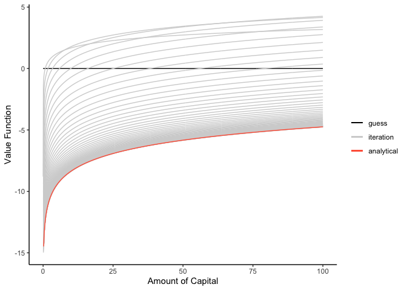<!-- -->

``` r
# another plot
p3 <- 
  ggplot() + 
  geom_line(aes(x = K, y = soln, color = 'soln'), alpha = 0.5) + 
  geom_line(aes(x = K, y = TV, color = 'TV'), alpha = 0.5) + 
  scale_color_manual(
    name = NULL, 
    values = c("soln" = "tomato", "TV" = "#00AFBB"), 
    labels = c("analytical", "numerical")
  ) +
  ylim(c(-15, NA)) + 
  labs(x = "Amount of Capital", y = "Value Function") + 
  theme_classic()
p3 # seems overlapped!
```

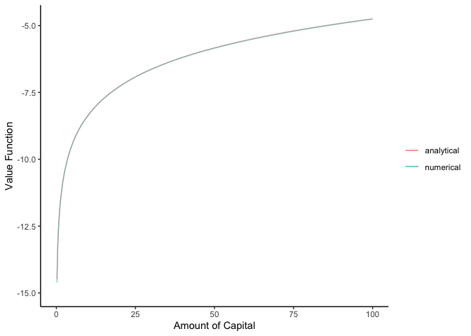<!-- --> Calculated Best
Path

``` r
ggplot() + 
  geom_line(aes(x = K, y = K[sol[, 2]], color = "numerical")) +
  geom_line(aes(x = K, y = Theta*(K^Alpha)*(aB), color = "analytical")) +
  scale_color_manual(
    name = NULL, 
    values = c("numerical" = "black", "analytical" = "tomato"), 
    labels = c("numerical", "analytical")
  ) + 
  labs(x = expression(paste("Amount of Capital ", k[t])), 
       y = expression(paste("Optimal ", k[t+1]))) +
  theme_classic()
```

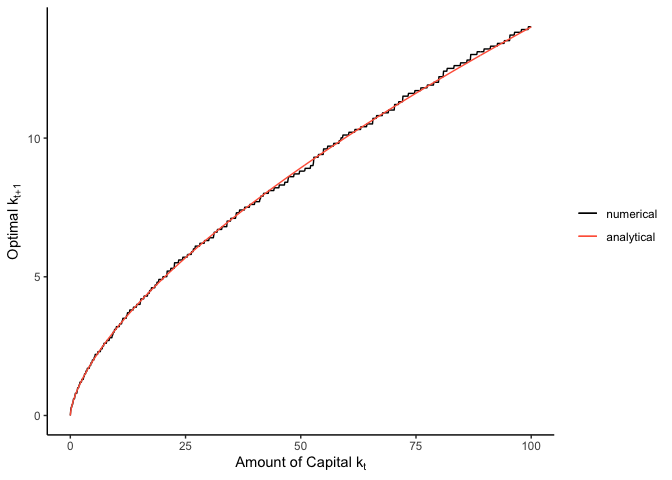<!-- -->

## 1-2. Policy Function Iteration

We are to solve the following functional equation:

 = \max_{\tilde{k}}{ \{u(f(k) - \tilde{k}) + \beta V(\tilde{k}) \} } .")

Note that


where

denotes a vector by which a value function is expressed, and

denotes the binary transition matrix whose

entry indicates whether each

is the optimal (or
)
given

or not. Here,

is a vactor whose each entry represents the maximized utility given
today’s capital
,
i.e., each entry is
)").
Solving this equation, we have

^{-1} U_j.")

This is the idea of the policy function iteration.

``` r
IteratePolicy <- function(V, maxK){
  # basic parameters
  Alpha <- 0.65
  Beta <- 0.9
  Theta <- 1.2
  
  grid <- length(V)
  K <- seq(from = 1e-6, to = maxK, length.out = grid)
  #TV <- rep(0, length(V))
  opt <- rep(0, length(V))
  
  # loop through and create new value function for each possible capital value
  for(k in 1:grid){
    c <- rep(Theta*(K[k]^Alpha), grid) - K
    c[c<=0] <- rep(0, sum(c<=0))
    u <- log(c)
    candid <- u + Beta*V
    #TV[k] <- max(candid)
    opt[k] <- which(candid == max(candid))
  }
  
  kopt <- K[opt]
  c <- Theta*K^Alpha - kopt
  u <- log(c)
  Q <- matrix(rep(0, grid*grid), ncol = grid)
  
  # create the transition matrix
  for(k in 1:grid){
    Q[k, opt[k]] <- 1
  }
  
  TV <- solve(diag(grid)-Beta*Q)%*%u
  sol <- matrix(c(TV, opt), ncol = 2)
  V <- TV
  return(sol)
}
```

``` r
tic()
# setting
K <- seq(from = 1e-6, to = 100, length.out = 1000) # grid
V <- rep(0, 1000) # guess
conv <- 100 # criterion for convergence
crit <- 1e-2 # stopping threshold
Iter <- 0 # numbering iteration


# for plot
df <- data.frame(K = K, V = V)
p4 <- ggplot() 
# iteration
while(conv>crit && Iter<1000){
  Iter <- Iter + 1
  if(Iter %/% 10 == Iter/10) cat("Iteration number:", Iter, "\n")
  
  # mapping
  sol <- IteratePolicy(V, 100)
  TV <- sol[, 1]
  opt <- sol[, 2]
  
  # distance between TV and V
  conv<- max(abs(TV-V))
  
  # for plot
  df$K_opt <- K[opt] 
  p4 <- p4 + geom_line(data = df, aes(x = K, y = K_opt, color = 'iteration')) 
  
  # pass TV to next iteration
  V <- TV
}
toc()
```

    ## 1.379 sec elapsed

``` r
cat("# of outer iterations:", Iter)
```

    ## # of outer iterations: 7

``` r
# plot
p4 <- p4 + 
  geom_line(aes(x = K, y = aB*(K^Alpha), color = 'analytical')) + 
  scale_color_manual(
    name = NULL, 
    values = c("iteration" = "lightgray", "analytical" = "tomato"), 
    labels = c("iteration", "analytical")
  ) +
  labs(x = expression(paste("Amount of Capital ", k[t])), 
       y = expression(paste("Optimal ", k[t+1]))) +
  theme_classic() 
p4
```

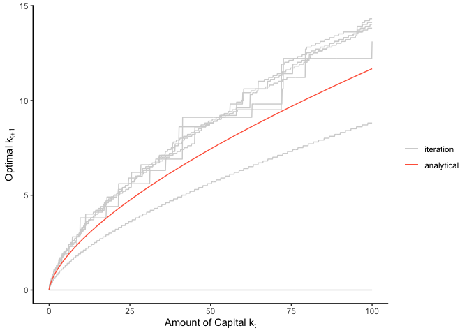<!-- -->

## 1-3. Finite Stochastic Dynamic Programming

This part is based on Chapter 6, “6.4 Stochastic Dynamic Programming”.

``` r
tic()
# setup parameters
e <- c(-2, 2)
PI <- c(0.5, 0.5)
Beta <- 0.9
Theta <- 1.2
Alpha <- 0.98
Kl <- 100
grid <- 0.1
t <- 10
K <- seq(from = 0, to = Kl + max(e), by = grid)
V <- cbind(matrix(rep(NA, length(K)*t), ncol = t), matrix(rep(0, length(K)), ncol = 1))
aux <- array(rep(NA, length(K)*length(K)*t), dim = c(length(K), length(K), t))

# loop over preriods
for(t_iter in seq(from = t, to = 1, by = -1)){
  cat("Currently in period", t_iter, "\n")
  
  # loop over k_{t}
  for(inK in 1:length(K)){
  # for(inK in 1:length(seq(from = 0, to = Kl, by = grid))){ # seems mistaken
    # loop over k_{t + 1}
    for(outK in 1:inK){
      c <- K[inK] - (K[outK]/Theta)^(1/Alpha) # note this is scaler
      nextKl <- Theta*(K[inK] - c)^Alpha + e[1]
      nextKh <- Theta*(K[inK] - c)^Alpha + e[2]
      nextKl[nextKl < 0] <- rep(0, sum(nextKl < 0))
      
      position_l <- ifelse((round(nextKl/grid) + 1) <= length(K), 
                           (round(nextKl/grid) + 1), 
                           length(K))
      position_h <- ifelse((round(nextKh/grid) + 1) <= length(K),
                           (round(nextKh/grid) + 1), 
                           length(K))
      EnextV <- 
        PI[1] * V[position_l, t_iter+1] + PI[2] * V[position_h, t_iter+1]
        #PI[1] * V[(round(nextKl/grid) + 1), t_iter+1] + 
        #PI[2] * V[(round(nextKh/grid) + 1), t_iter+1] # seems mistaken
      
      #c <- ifelse(c <= 0, 1e-100, c) # if you want to avoid -Inf
      aux[inK, outK, t_iter] <- log(c) + Beta*EnextV
    }
  }
  V[, t_iter] <- 
    apply(
      X = as.matrix(aux[, , t_iter]), MARGIN = 1, FUN = max, na.rm = TRUE
    )
}
```

    ## Currently in period 10 
    ## Currently in period 9 
    ## Currently in period 8 
    ## Currently in period 7 
    ## Currently in period 6 
    ## Currently in period 5 
    ## Currently in period 4 
    ## Currently in period 3 
    ## Currently in period 2 
    ## Currently in period 1

``` r
toc()
```

    ## 16.288 sec elapsed

Simulation

``` r
tic()
# setup parameters and simulate shocks
set.seed(2022)
people <- 100
epsilon <- 
  ifelse(purrr::rbernoulli(people*(t+1), 0.5), 2, -2) %>% 
  matrix(ncol = t+1)
vf <- 
  rep(NA, people*t) %>% 
  matrix(ncol = t)
kap <- # capital
  cbind(
    Kl*(rep(1, people)), # k_{0}
    matrix(rep(NA, people*t), ncol = t)
  )
con <- # consumption
  rep(NA, people*t) %>% 
  matrix(ncol = t)

for(p in 1:people){
  for(t_iter in 1:t){
    position <- round(kap[p, t_iter]/grid + 1)
    vf[p, t_iter] <- V[position, t_iter]
    kap[p, t_iter + 1] <- K[which(aux[position, , t_iter] == vf[p, t_iter])]
    con[p, t_iter] <- kap[p, t_iter] - (kap[p, t_iter+1]/Theta)^(1/Alpha)
    kap[p, t_iter + 1] <- kap[p, t_iter + 1] + epsilon[p + t_iter + 1]
  }
}
toc()
```

    ## 0.027 sec elapsed

plot

``` r
p_5 <- ggplot()
for(i in 1:people){
  df <- data.frame(time = 1:t, consumption = con[i, ])
  p_5 <- p_5 + 
    geom_line(
      data = df, aes(x = time, y = consumption), 
      color = sample(brewer.pal(12, "Paired"), 1)
    )
}
p_5 <- p_5 +
  labs(x = "Time", y = "Consumption") + 
  theme_classic()
p_5
```

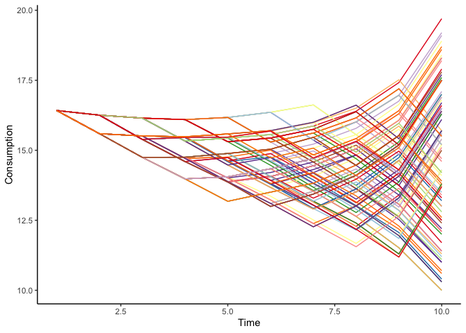<!-- -->

# 2. Exercise

## (i)

We have


``` r
Beta <- 0.9
Alpha <- 0.65
Theta <- 1.2
aB <- Alpha*Beta


K <- seq(from = 1e-6, to = 100, length.out = 1000) # grid
V <- rep(0, 1000) # guess
conv <- 100 # criterion for convergence
crit <- 1e-2 # stopping threshold
Iter <- 0 # numbering iteration

# for plot
df <- data.frame(K = K, V = V)

# iteration
while(conv>crit && Iter<1000){
  Iter <- Iter + 1
  if(Iter %/% 10 == Iter/10) cat("Iteration number:", Iter, "\n")
  
  # mapping
  sol <- IterateVF(V, 100)
  TV <- sol[, 1]
  
  # distance between TV and V
  conv <- max(abs(TV-V))
  
  # for plot
  df$TV <- TV # store TV in a data.frame to layer plots
  
  # pass TV to next iteration
  V <- TV
}
```

    ## Iteration number: 10 
    ## Iteration number: 20 
    ## Iteration number: 30 
    ## Iteration number: 40 
    ## Iteration number: 50 
    ## Iteration number: 60

``` r
C_opt <- Theta*K^Alpha - K[sol[, 2]]
ggplot() + 
  geom_line(aes(x = K, y = C_opt, color = "numerical")) + 
  geom_line(aes(x = K, y = Theta*(K^Alpha)*(1-aB), color = "analytical")) + 
  scale_color_manual(
    name = NULL, 
    values = c("numerical" = "black", "analytical" = "tomato"), 
    labels = c("numerical", "analytical")
  ) + 
  labs(x = expression(paste("Amount of Capital ", k[t])), 
       y = expression(paste("Optimal ", c[t]))) +
  theme_classic()
```

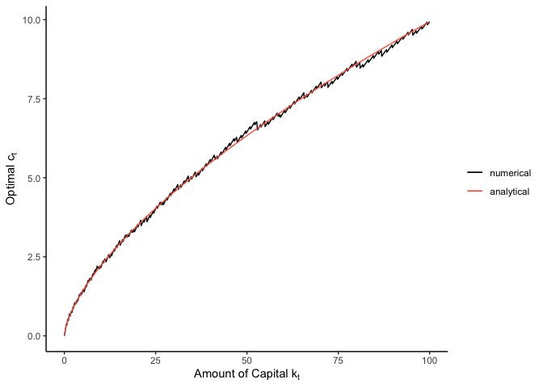<!-- -->

## (ii)

Note that the transition equation is

 - c_t + \varepsilon_{t + 1},")

where the production function is set as
 = \theta k^{\alpha}").
The value function is written as

![V(k\_{t}) = \max\_{c\_{t} \in (0, k_t\]}{ \\{ u(c_t) + \beta E_t\[V(k\_{t+1}-\varepsilon\_{t+1})\] \\}}.](https://latex.codecogs.com/png.image?%5Cdpi%7B110%7D&space;%5Cbg_white&space;V%28k_%7Bt%7D%29%20%3D%20%5Cmax_%7Bc_%7Bt%7D%20%5Cin%20%280%2C%20k_t%5D%7D%7B%20%5C%7B%20u%28c_t%29%20%2B%20%5Cbeta%20E_t%5BV%28k_%7Bt%2B1%7D-%5Cvarepsilon_%7Bt%2B1%7D%29%5D%20%5C%7D%7D. "V(k_{t}) = \max_{c_{t} \in (0, k_t]}{ \{ u(c_t) + \beta E_t[V(k_{t+1}-\varepsilon_{t+1})] \}}.")

### (ii)-(a)

``` r
# one iteration of the value function
IterateStochastic <- function(V, maxK){
  # basic parameters
  Alpha <- 0.65
  Beta <- 0.9
  Theta <- 1.2
  e <- c(-2, 2)
  PI <- c(0.5, 0.5)
  
  grid <- length(V)
  K <- seq(from = 1e-6, to = maxK, length.out = grid)
  TV <- rep(0, length(V))
  optC <- rep(0, length(V))
  
  # loop through and create new value function for each possible capital value
  for(k in 1:grid){
    C <- seq(from = 1e-10, to = K[k], by = 0.1)
    #c <- rep(Theta*(K[k]^Alpha), grid) - K
    nextKl <- rep(Theta*K[k]^Alpha, length(C)) - C + e[1]
    nextKh <- rep(Theta*K[k]^Alpha, length(C)) - C + e[2]
    nextKl[nextKl < 0] <- rep(0, sum(nextKl < 0))
    
    
    EnextV <- rep(0, length(C))
    position_l <- rep(0, length(C))
    position_h <- rep(0, length(C))
    
    for(i in 1:length(C)){
      position_l[i] <- which(abs(K - nextKl[i]) == min(abs(K - nextKl[i])))[1]
      position_h[i] <- which(abs(K - nextKh[i]) == min(abs(K - nextKh[i])))[1]
      EnextV[i] <- PI[1] * V[position_l[i]] + PI[2] * V[position_h[i]]
    }
    
    u <- log(C)
    candid <- u + Beta*EnextV
    TV[k] <- max(candid)
    optC[k] <- which(candid == max(candid))
  }
  
  sol <- matrix(c(TV, optC), nrow = length(V), ncol = 2, byrow = FALSE)
  return(sol)
}
```

Convergence of Value Function

``` r
tic()
# setting
K <- seq(from = 1e-6, to = 100, length.out = 1000) # grid
V <- rep(0, 1000) # guess
conv <- 100 # criterion for convergence
crit <- 1e-2 # stopping threshold
Iter <- 0 # numbering iteration

# for plot
df <- data.frame(K = K, V = V)
p7 <- ggplot() + 
  geom_line(data = df, aes(x = K, y = V, color = 'guess'))

# iteration
while(conv>crit && Iter<1000){
  Iter <- Iter + 1
  if(Iter %/% 10 == Iter/10) cat("Iteration number:", Iter, "\n")
  
  # mapping
  sol <- IterateStochastic(V, 100)
  TV <- sol[, 1]
  
  # distance between TV and V
  conv <- max(abs(TV-V))
  
  # for plot
  df$TV <- TV # store TV in a data.frame to layer plots
  p7 <- p7 + geom_line(data = df, aes(x = K, y = TV, color = 'iteration')) 
  
  # pass TV to next iteration
  V <- TV
}
```

    ## Iteration number: 10 
    ## Iteration number: 20 
    ## Iteration number: 30 
    ## Iteration number: 40 
    ## Iteration number: 50 
    ## Iteration number: 60

``` r
V_stoch <- V
optC_stoch <- sol[, 2]
toc()
```

    ## 697.984 sec elapsed

``` r
cat("# of iterations:", Iter)
```

    ## # of iterations: 66

``` r
# plot
p7 <- p7 + 
  geom_line(aes(x = K, y = soln, color = 'deterministic')) + 
  scale_color_manual(
    name = NULL, 
    values = c("guess" = "black", "iteration" = "lightgray", "deterministic" = "tomato"), 
    labels = c("guess", "iteration", "deterministic")
  ) +
  labs(x = "Amount of Capital", y = "Value Function") +
  theme_classic() 
p7
```

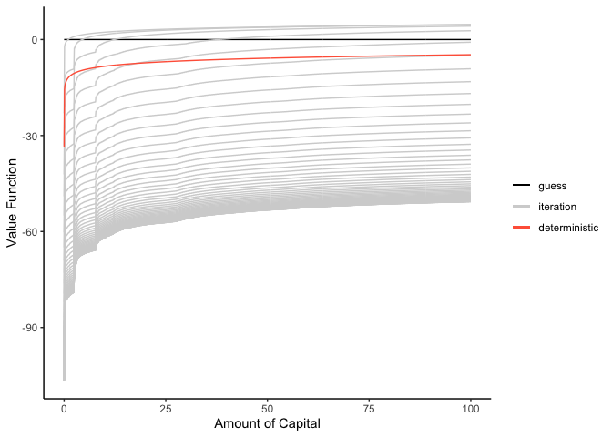<!-- -->

Comparison of stochastic and deterministic dynamic programming

``` r
ggplot() + 
  geom_line(aes(x = K, y = V_stoch, color = "stochastic")) + 
  geom_line(aes(x = K, y = soln, color = 'deterministic')) + 
  scale_color_manual(
    name = NULL, 
    values = c("stochastic" = "#00AFBB", "deterministic" = "tomato"), 
    labels = c("stochastic", "deterministic")
  ) +
  labs(x = "Amount of Capital", y = "Value Function") +
  theme_classic() 
```

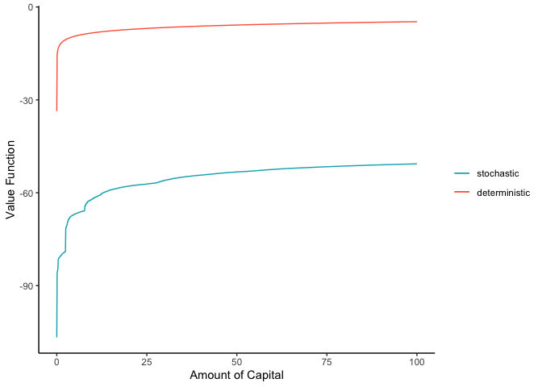<!-- -->

Simulation

``` r
tic()
# setup parameters and simulate shocks
set.seed(2022)
t <- 10
people <- 100
Kl <- 100
V <- cbind(matrix(rep(NA, length(K)*t), ncol = t), matrix(rep(0, length(K)), ncol = 1))
epsilon <- 
  ifelse(purrr::rbernoulli(people*(t+1), 0.5), 2, -2) %>% 
  matrix(ncol = t+1)
vf <- 
  rep(NA, people*t) %>% 
  matrix(ncol = t)
kap <- # capital
  cbind(
    Kl*(rep(1, people)), # k_{0}
    matrix(rep(NA, people*t), ncol = t)
  )
con <- # consumption
  rep(NA, people*t) %>% 
  matrix(ncol = t)

for(p in 1:people){
  for(t_iter in 1:t){
    position <- 
      which(abs(K - kap[p, t_iter]) == min(abs(K - kap[p, t_iter]), na.rm = TRUE))[1]
    vf[p, t_iter] <- V_stoch[position]
    
    con[p, t_iter] <- 
      seq(from = 1e-10, to = K[position], by = 0.1)[optC_stoch[position]]
    k_tmp <- Theta*kap[p, t_iter]^(Alpha) - con[p, t_iter] + epsilon[p + t_iter + 1]
    kap[p, t_iter + 1] <- ifelse(k_tmp > 0, k_tmp, 0)
  }
}
toc()
```

    ## 0.029 sec elapsed

plot consumption transition

``` r
p_8 <- ggplot()
for(i in 1:people){
  df <- data.frame(time = 1:t, consumption = con[i, ])
  p_8 <- p_8 + 
    geom_line(
      data = df, aes(x = time, y = consumption), 
      color = sample(brewer.pal(12, "Paired"), 1)
    )
}
p_8 <- p_8 +
  labs(x = "Time", y = "Consumption") + 
  theme_classic()
p_8
```

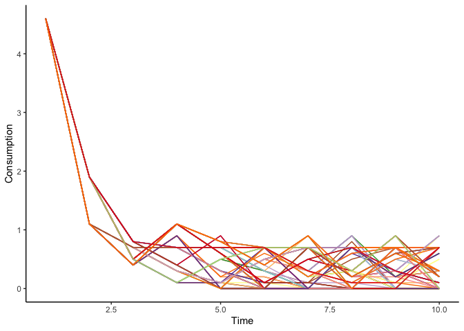<!-- -->

``` r
p_9 <- ggplot()
for(i in 1:people){
  df <- data.frame(time = 0:t, capital = kap[i, ])
  p_9 <- p_9 + 
    geom_line(
      data = df, aes(x = time, y = capital), 
      color = sample(brewer.pal(12, "Paired"), 1)
    )
}
p_9 <- p_9 +
  labs(x = "Time", y = "Capital") + 
  theme_classic()
p_9
```

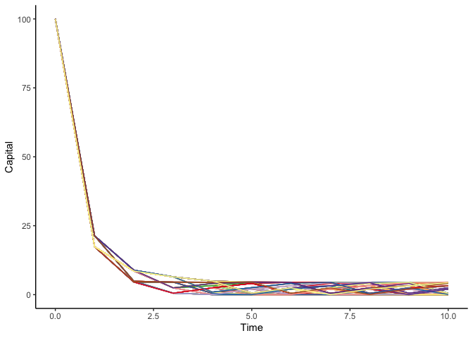<!-- -->

### (ii)-(b)

``` r
tic()
# setup parameters and simulate shocks
set.seed(2022)
t <- 10
people <- 100
Kl <- 100
V <- cbind(matrix(rep(NA, length(K)*t), ncol = t), matrix(rep(0, length(K)), ncol = 1))
epsilon <- 
  ifelse(purrr::rbernoulli(people*(t+1), 0.5), 2, -2) %>% 
  matrix(ncol = t+1)
vf <- 
  rep(NA, people*t) %>% 
  matrix(ncol = t)
kap <- # capital
  cbind(
    runif(people, min = 50, max = 100), # k_{0}
    matrix(rep(NA, people*t), ncol = t)
  )
con <- # consumption
  rep(NA, people*t) %>% 
  matrix(ncol = t)

for(p in 1:people){
  for(t_iter in 1:t){
    position <- 
      which(abs(K - kap[p, t_iter]) == min(abs(K - kap[p, t_iter]), na.rm = TRUE))[1]
    vf[p, t_iter] <- V_stoch[position]
    
    con[p, t_iter] <- 
      seq(from = 1e-10, to = K[position], by = 0.1)[optC_stoch[position]]
    k_tmp <- Theta*kap[p, t_iter]^(Alpha) - con[p, t_iter] + epsilon[p + t_iter + 1]
    kap[p, t_iter + 1] <- ifelse(k_tmp > 0, k_tmp, 0)
  }
}
toc()
```

    ## 0.042 sec elapsed

Transision of Consumption

``` r
p_10 <- ggplot()
for(i in 1:people){
  df <- data.frame(time = 1:t, consumption = con[i, ])
  p_10 <- p_10 + 
    geom_line(
      data = df, aes(x = time, y = consumption), 
      color = sample(brewer.pal(12, "Paired"), 1)
    )
}
p_10 <- p_10 +
  labs(x = "Time", y = "Consumption") + 
  theme_classic()
p_10
```

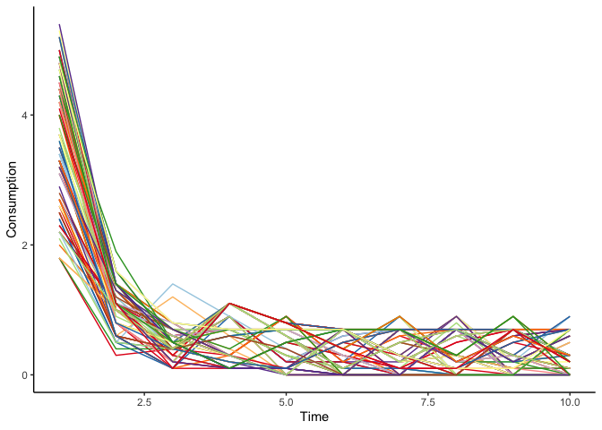<!-- -->

Transision of Capital

``` r
p_11 <- ggplot()
for(i in 1:people){
  df <- data.frame(time = 0:t, capital = kap[i, ])
  p_11 <- p_11 + 
    geom_line(
      data = df, aes(x = time, y = capital), 
      color = sample(brewer.pal(12, "Paired"), 1)
    )
}
p_11 <- p_11 +
  labs(x = "Time", y = "Capital") + 
  theme_classic()
p_11
```

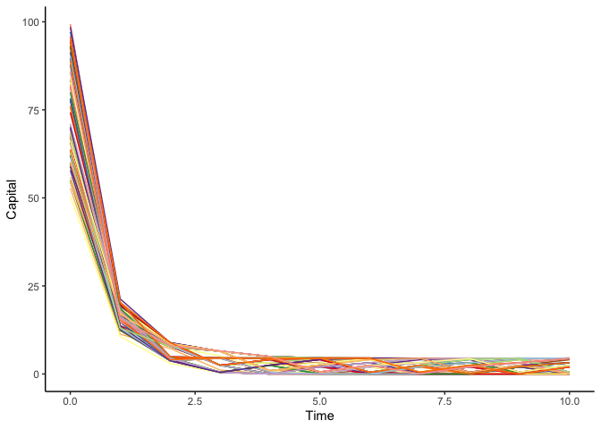<!-- -->

## (iii)

# Reference

-   [Adams, A., D. Clarke, and S. Quinn. Microeconometrics and MATLAB.
    Oxford University Press,
    2015.](https://global.oup.com/academic/product/microeconometrics-and-matlab-an-introduction-9780198754497?cc=jp&lang=en&)
