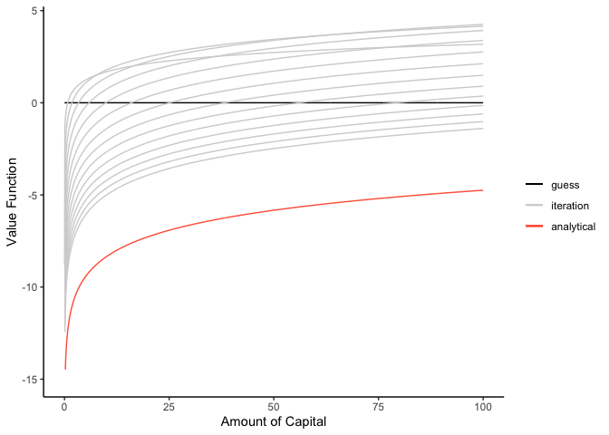

Dynamic Choice on an Infinite Horizon
================
Yoshinari Namba
2022-08-09

# 0. Introduction

This is the replication of [Adams, et al.(2015)](#reference), Chapter 7.

# 1. Replication

## Setup

``` r
# initialize
rm(list = ls())

# package
if(!require(pacman)) install.packages("packman")
pacman::p_load(
  tidyverse, 
  tictoc
)
```

## 1-1. Value Function Iteration

``` r
# one iteration of the value function
IterateVF <- function(V, maxK){
  # basic parameters
  Alpha <- 0.65
  Beta <- 0.9
  Theta <- 1.2
  
  grid <- length(V)
  K <- seq(from = 1e-6, to = maxK, length.out = grid)
  TV <- rep(0, length(V))
  optK <- rep(0, length(V))
  
  # loop through and create new value function for each possible capital value
  for(k in 1:grid){
    c <- rep(Theta*(K[k]^Alpha), grid) - K
    c[c<=0] <- rep(0, sum(c<=0))
    u <- log(c)
    candid <- u + Beta*V
    TV[k] <- max(candid)
    optK[k] <- K[which(candid == max(candid))]
  }
  
  # time consuming method 
  # candid <- rep(NA, 1000)
  # c <- rep(NA, grid)
  # u <- rep(NA, grid)
  # 
  # for(k in 1:grid){
  #   for(k_tilde in 1:grid){
  #     c[k_tilde] <- Theta*(K[k]^Alpha)-K[k_tilde]
  #     c[k_tilde] <- ifelse(c[k_tilde] > 0, c[k_tilde], 0)
  #     u[k_tilde] <- log(c[k_tilde])
  #     candid[k_tilde] <- u[k_tilde] + Beta*V[k_tilde]
  #   }
  #   TV[k] <- max(candid)
  #   optK[k] <- K[which(candid == max(candid))]
  # }
  
  sol <- matrix(c(TV, optK), nrow = length(V))
  return(sol)
}
```

Analytical solution

``` r
# set parameters, plot analytical solution
Beta <- 0.9
Alpha <- 0.65
Theta <- 1.2
aB <- Alpha*Beta
K <- seq(from = 1e-6, to = 100, length.out = 1000)

E <- Alpha / (1 - aB)
f <- (1/(1-Beta))*(log(Theta*(1-aB))) + aB*log(aB*Theta)/((1-aB)*(1-Beta))
soln <- E*log(K) + f

ggplot() + 
  geom_line(aes(x = K, y = soln)) + 
  ylim(c(-15, NA)) + 
  xlab("Amount of Capital") + ylab("Value Function") +
  theme_classic() 
```

<!-- -->

Iterated graph

``` r
tic()
n <- 15
# 10 iterations 
TV <- matrix(rep(NA, 1000*n), ncol = n)
TV[, 1] <- rep(0, 1000) 

for(iter in 1:n){
  cat("Iteration number:", iter, "\n")
  if(iter < n) TV[, iter+1] <- IterateVF(TV[, iter], 100)[, 1]
}
```

    ## Iteration number: 1 
    ## Iteration number: 2 
    ## Iteration number: 3 
    ## Iteration number: 4 
    ## Iteration number: 5 
    ## Iteration number: 6 
    ## Iteration number: 7 
    ## Iteration number: 8 
    ## Iteration number: 9 
    ## Iteration number: 10 
    ## Iteration number: 11 
    ## Iteration number: 12 
    ## Iteration number: 13 
    ## Iteration number: 14 
    ## Iteration number: 15

``` r
toc()
```

    ## 0.429 sec elapsed

``` r
# plot
tic()
p1 <- ggplot() 
for(i in 1:n){
  df <- data.frame(k = K, tv = TV[, i]) # store TV in a data.frame to layer plots
  if(i == 1){
    p1 <- p1 + geom_line(data = df, aes(x = k, y = tv, color = 'guess'))
  } else{
    p1 <- p1 + geom_line(data = df, aes(x = k, y = tv, color = 'iteration')) 
  }
}
p1 <- p1 + 
  geom_line(data = df, aes(x = k, y = soln, color = "analytical")) + 
  scale_color_manual(
    name = NULL, 
    values = c("guess" = "black", "iteration" = "lightgray", "analytical" = "tomato"), 
    labels = c("guess", "iteration", "analytical")
  ) +
  ylim(c(-15, NA)) + 
  labs(x = "Amount of Capital", y = "Value Function") +
  theme_classic() 
p1
```

<!-- -->

``` r
toc()
```

    ## 0.234 sec elapsed

Convergence of Value Function

``` r
tic()
# setting
K <- seq(from = 1e-6, to = 100, length.out = 1000) # grid
V <- rep(0, 1000) # guess
conv <- 100 # criterion for convergence
crit <- 1e-2 # stopping threshold
Iter <- 0 # numbering iteration

# for plot
df <- data.frame(K = K, V = V)
p2 <- ggplot() + 
  geom_line(data = df, aes(x = K, y = V, color = 'guess'))

# iteration
while(conv>crit && Iter<1000){
  Iter <- Iter + 1
  if(Iter %/% 10 == Iter/10) cat("Iteration number:", Iter, "\n")
  
  # mapping
  sol <- IterateVF(V, 100)
  TV <- sol[, 1]
  
  # distance between TV and V
  conv <- max(abs(TV-V))
  
  # for plot
  df$TV <- TV # store TV in a data.frame to layer plots
  p2 <- p2 + geom_line(data = df, aes(x = K, y = TV, color = 'iteration')) 
  
  # pass TV to next iteration
  V <- TV
}
```

    ## Iteration number: 10 
    ## Iteration number: 20 
    ## Iteration number: 30 
    ## Iteration number: 40 
    ## Iteration number: 50 
    ## Iteration number: 60

``` r
toc()
```

    ## 2.021 sec elapsed

``` r
cat("# of iterations:", Iter)
```

    ## # of iterations: 66

``` r
# plot
p2 <- p2 + 
  geom_line(aes(x = K, y = soln, color = 'analytical')) + 
  scale_color_manual(
    name = NULL, 
    values = c("guess" = "black", "iteration" = "lightgray", "analytical" = "tomato"), 
    labels = c("guess", "iteration", "analytical")
  ) +
  ylim(c(-15, NA)) + 
  labs(x = "Amount of Capital", y = "Value Function") +
  theme_classic() 
p2
```

<!-- -->

``` r
# another plot
p3 <- 
  ggplot() + 
  geom_line(aes(x = K, y = soln, color = 'soln'), alpha = 0.5) + 
  geom_line(aes(x = K, y = TV, color = 'TV'), alpha = 0.5) + 
  scale_color_manual(
    name = NULL, 
    values = c("soln" = "tomato", "TV" = "#00AFBB"), 
    labels = c("analytical", "numerical")
  ) +
  ylim(c(-15, NA)) + 
  labs(x = "Amount of Capital", y = "Value Function") + 
  theme_classic()
p3 # seems overlapped!
```

<!-- -->

## 1-2. Policy Function Iteration

We are to solve the following functional equation:

 = \max_{\tilde{k}}{ \{u(f(k) - \tilde{k}) + \beta V(\tilde{k}) \} } .")

Note that


where

denotes a vector by which a value function is expressed, and

denotes the binary transition matrix whose

entry indicates whether each

is the optimal (or
)
given

or not. Here,

is a vactor whose each entry represents the maximized utility given
today’s capital
,
i.e., each entry is
)").
Solving this equation, we have

^{-1} U_j.")

This is the idea of the policy function iteration.

``` r
IteratePolicy <- function(V, maxK){
  # basic parameters
  Alpha <- 0.65
  Beta <- 0.9
  Theta <- 1.2
  
  grid <- length(V)
  K <- seq(from = 1e-6, to = maxK, length.out = grid)
  #TV <- rep(0, length(V))
  opt <- rep(0, length(V))
  
  # loop through and create new value function for each possible capital value
  for(k in 1:grid){
    c <- rep(Theta*(K[k]^Alpha), grid) - K
    c[c<=0] <- rep(0, sum(c<=0))
    u <- log(c)
    candid <- u + Beta*V
    #TV[k] <- max(candid)
    opt[k] <- which(candid == max(candid))
  }
  
  kopt <- K[opt]
  c <- Theta*K^Alpha - kopt
  u <- log(c)
  Q <- matrix(rep(0, grid*grid), ncol = grid)
  
  # create the transition matrix
  for(k in 1:grid){
    Q[k, opt[k]] <- 1
  }
  
  TV <- solve(diag(grid)-Beta*Q)%*%u
  sol <- matrix(c(TV, opt), ncol = 2)
  V <- TV
  return(sol)
}
```

``` r
tic()
# setting
K <- seq(from = 1e-6, to = 100, length.out = 1000) # grid
V <- rep(0, 1000) # guess
conv <- 100 # criterion for convergence
crit <- 1e-2 # stopping threshold
Iter <- 0 # numbering iteration


# for plot
df <- data.frame(K = K, V = V)
p4 <- ggplot() 
# iteration
while(conv>crit && Iter<1000){
  Iter <- Iter + 1
  if(Iter %/% 10 == Iter/10) cat("Iteration number:", Iter, "\n")
  
  # mapping
  sol <- IteratePolicy(V, 100)
  TV <- sol[, 1]
  opt <- sol[, 2]
  
  # distance between TV and V
  conv<- max(abs(TV-V))
  
  # for plot
  df$K_opt <- K[opt] 
  p4 <- p4 + geom_line(data = df, aes(x = K, y = K_opt, color = 'iteration')) 
  
  # pass TV to next iteration
  V <- TV
}
toc()
```

    ## 1.384 sec elapsed

``` r
cat("# of outer iterations:", Iter)
```

    ## # of outer iterations: 7

``` r
# plot
p4 <- p4 + 
  geom_line(aes(x = K, y = aB*(K^Alpha), color = 'analytical')) + 
  scale_color_manual(
    name = NULL, 
    values = c("iteration" = "lightgray", "analytical" = "tomato"), 
    labels = c("iteration", "analytical")
  ) +
  labs(x = expression(paste("today's capital ", k[t])), 
       y = expression(paste("tomorrow's capital ", k[t+1]))) +
  theme_classic() 
p4
```

<!-- -->

# 2. Exercise

## (i)

## (ii)

### (ii)-(a)

### (ii)-(b)

## (iii)

# Reference

-   [Adams, A., D. Clarke, and S. Quinn. Microeconometrics and MATLAB.
    Oxford University Press,
    2015.](https://global.oup.com/academic/product/microeconometrics-and-matlab-an-introduction-9780198754497?cc=jp&lang=en&)
